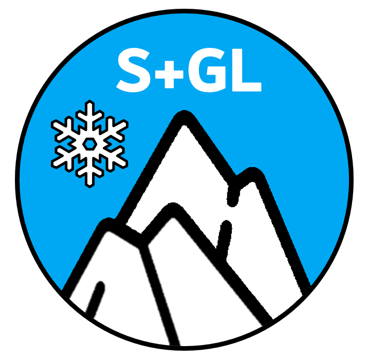

# SWAT+GL Rev61.0 

This repository contains SWAT+GL, a modified version of the hydrological model [SWAT+](https://swat.tamu.edu/) (Soil Water Assessment Tool). SWAT+GL extends the traditional SWAT+ by explicitly considering glacier dynamics. It builds on SWAT-GL, the original initiative to improve the capabilities of the traditional SWAT2012. 

SWAT+GL was developed to improve the applicability of SWAT+ in high-mountaineous & glaciated basins. Besides, some minor modifications were made to make lapse rates and surface runoff lag spatially distirbuted rather than global parameters.
Summarized, it consists of:

1. Mass Balance Module
2. Glacier Evolution Module
3. Extended Snow Module
4. Spatially Distributed SURLAG, PLAPS, TLAPS

Mass balance calculations are based on a simple temperature-degree approach, similar as the snow routine of SWAT. Glacier evolution stems from the $\Delta$h-Parameterization ([Huss et al. 2010](https://hess.copernicus.org/articles/14/815/2010/)). 
  
The extended snow module contains a collection of snow melt approaches, that could be used alternatively to the default method of SWAT. Examples refer to rain on snow consideration or the incorporation of a radiation term.
  
Further insights about the implemention in SWAT can be received from our recently published Technical Note ([Schaffhauser et al. 2024](https://onlinelibrary.wiley.com/doi/10.1111/1752-1688.13199)), as well as our application article available as preprint in HESS ([Schaffhauser et al. 2024b](https://hess.copernicus.org/preprints/hess-2024-89/)).

## How to Cite

In case you will use SWAT-GL, please cite as follows:  

Schaffhauser, Timo, Ye Tuo, Florentin Hofmeister, Gabriele Chiogna, Jingshui Huang, Fabian Merk and Markus Disse. 2024. “ SWAT-GL: A New Glacier Routine For the Hydrological Model SWAT.” JAWRA Journal of the American Water Resources Association 00 (0): 1–12. https://doi.org/10.1111/1752-1688.13199.

## Contact

In case you find bugs & errors, have feedback or face any kind of application issues, please contact Timo Schaffhauser via [t.schaffhauser@tum.de](mailto:t.schaffhauser@tum.de).

## Download

https://gitlab.com/lshm1/swat-g 
  Use the latest version and navigate to *src/gl_routine* to find the executable of the current release.
 
An example SWAT-GL model can be downloaded from [Zenodo](https://zenodo.org/records/10962425)
