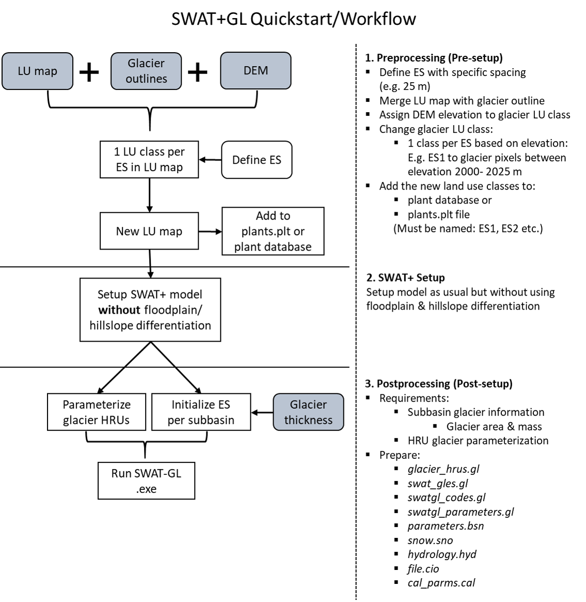

# 

***

# SWAT+GL Documentation

This document contains information on how to prepare the inputs to execute SWAT+GL and the theoritical documentation of introduced concepts. For further theoretical insights of the $\Delta$h-Parameterization we refer to: [Huss et al. 2010](https://hess.copernicus.org/articles/14/815/2010/) and [Huss et al. 2008](https://onlinelibrary.wiley.com/doi/10.1002/hyp.7055). In general, all concepts are supplemented with the corresponding references, which are recommended to read before application for more detailed information.  More technical details and backgrounds can be obtained from our just recently published Technical Note: [Schaffhauser et al. 2024](https://onlinelibrary.wiley.com/doi/10.1111/1752-1688.13199). 
A further publication providing an application in 4 contrasting glacier basins is available in HESS (preprint): [Schaffhauser et al. 2024b](https://hess.copernicus.org/preprints/hess-2024-89/).

***

# 1) General Overview: Requirements

## Demo Model

A test model from the Martelltal can be obtained from the example folder. It can be used to get used to the new and modified input/output files. 

## Quickstart

Users **are advised to currently not setup the model using a floodplain/hillslope differentiation** in order to let SWAT+GL work properly and get maximum benefit of the module. 

## Required Input Data for Model Setup

1. Glacier Outlines
2. Glacier Thickness 

Both datasets are needed for the initialization of SWAT+GL. Glacier outlines for example often stem from the [Randolph Glacier Inventory](https://www.glims.org/RGI/), from which one can infer glacier areas. The second information, glacier thicknesses, can nowadays for example be derived from [Farinotti et al. 2019](https://www.nature.com/articles/s41561-019-0300-3) or [Millan et al. 2022](https://www.nature.com/articles/s41561-021-00885-z). 

## New Input Files to prepare

1. *swat_gles.gl*
2. *glacier_hrus.gl*
3. *swatgl_codes.gl*
4. *swatgl_parameters.gl*
5. *snow.sno* (already existing but modified)
6. *hydrology.hru* (already existing but modified)
7. *file.cio* (already existing but modifies)

File names are hard-coded and thus must be used as written above. One example file for each can be found in the documentation folder.
  
The files can be described as follows:  
**swatgl_codes.gl** includes the information of the general SWAT+GL snow and glacier-specific setup. In detail, 6 parameters are provided. Parameters are related to the newly introduced melt routines: ETI (Enhanced Temperature-Index, [Pelliccotti et al. 2005](https://www.cambridge.org/core/journals/journal-of-glaciology/article/an-enhanced-temperatureindex-glacier-melt-model-including-the-shortwave-radiation-balance-development-and-testing-for-haut-glacier-darolla-switzerland/E96A8B8D2903523DE6DBF88E2E06E6D9)), HTI (Hock Temperature Index, [Hock 1999](https://www.cambridge.org/core/journals/journal-of-glaciology/article/distributed-temperatureindex-ice-and-snowmelt-model-including-potential-direct-solar-radiation/2013F2D6B911401D67EA84728AF93629)), a ROS (Rain on Snow) correction, as well as precipitation adaption allowing for mixed precipitation (solid and liquid) and an exponential TI method (both [Magnusson et al. 2014](https://agupubs.onlinelibrary.wiley.com/doi/full/10.1002/2014WR015302)). The file defines the following parameters: a parameter to select the snow melt model (sm_model), a decision flag to allow for additional melt for rain on snow events (ros_flag), a parameter to select how snow cover is linked with the glacier routine (gm_init), a parameter that sets whether the degree day factor for ice is automatically corrected if it is smaller than the counterpart for snow or not (fgmlt_cor). Besides, there is a flag for mixed precipitation to be allowed (pmix_flag) and a parameter that allows to switch between 2 different accumulation (snow to ice) models (acc_mod).  

The **swatgl_parameters.gl** file is especially there for further releases, however, at the current release only consists of 1 parameter, which is the global temperature below which mixed precipitation occurs (tmix_ul). It is only active in combination with pmix_glag being set to 1 in the swatgl_codes.gl file. 

The already existing **snow.sno** file is modified and receives 4 additional columns. One temperature factor of snow (tfac_s) when the ETI and HTI approaches are used to calculate snow melt, the radiation factor of snow (rfac_s) for the HTI model, the short wave radiation factor (srfac_s) for the ETI model and the exponential melt factor value (f_exp).  

The already existing **hydrology.hyd** file is modified and receives 3 additional columns. One column for the spatially distributed version of the surface runoff lag factor (surlag), one for the spatially distributed temperature lapse rate (tlaps) and one for the spatially distributed version of the precipitation lapse rate.  

The already existing **codes.bsn** file is modified and receives 1 additional column and 1 existing colum receives an additional argument. The new column sets whether surlag is used globally as in the standard SWAT+, where the value is set via the parameters.bsn file or whether the new spatially distributed version via the hydrology.hyd file is used (column is called surlag_sd). The lapse column is modified so that a flag of 2 uses the spatially distributed lapse rate version with values from the hydrology.hyd. 

The **glacier_hrus.gl** contains the HRU-specific parameter information of the glacier routine. In detail, 9 new parameters are here defined for all glaciated HRUs. The file consists of 11 columns, namely the HRU ID (hru_id), the subbasin ID (sub_id), the glacier melt temperature (glmtmp), the maximum glacier melt factor on June 21st (glmfmx), the minimum glacier melt factor on June 21st (glmfmn), the refreezing rate of melt (f_frz), as well as the transfer rate of snow to ice (f_accu), the temperature factor of ice (tfac_i) when the ETI and HTI approaches are used, the radiation factor of ice (rfac_i) for the HTI model, the short wave radiation factor (srfac_i) for the ETI model and a lag factor similar to the snowmelt lag factor that was formerly known as TIMP (gl_lag). One line for each glacier HRU is necessary, e.g. if you have 25 glacier HRUs, the file consists of 25 lines plus the header line.   
The **swat_gles.gl** is used for the glacier mass initialization of SWAT+GL. The file is used to set the initial glacier area, thickness and volume throughout the basin. In detail, it contains the glacier information on the subbasin and ES scale. Glaciers are initialized on the subbasin scale, means that all glaciated areas within a subbasin correspond to a SWAT+-specific glacier. Further, for each subbasin a glacier area, volume and ice thickness need  to be defined for all ES. The file only covers glaciated subbasins and for each glaciated subbasin all ES must be defined. This means not only ES that actually are present in the subbasin, but also those who are not glaciated. If we assume a model with 20 ES on the basin scale an 3 subbasins that are glaciated the file would consist of 20 lines for each subbasin, making 60 lines which results in 61 lines including the header line. 0 value lines have to be provided for ES that are not ice covered in a specific subbasin. One important note is that the ice thickness must be provided in milimeter water equivalent [mm H20], area in square kilometers [km²] and ice volume in cubic kilometers [km³]. For the conversion of ice to water equivalent, e.g. a density of 917 kg/m³ is assumed.  

## Calibration Files

All newly introduced parameters are considered in the SWAT+ calibration scheme and can be incorporated in the *calibration.cal* file by using the names as they are in the corresponding header of the files (e.g. header in *glaciers_hru.gl*). Correspondingly, the cal_parm.cal file has to be extended by the SWAT+GL parameters before. 

## New & Modified Output Files

1. *xx_wb.txt* files were modified and now contain mass balance calculations.   
2. *gl_mb_aa.txt* is newly created and contains the annual glacier evolution estimates

## Hourly Representation

Under progress and updated soon.

****

# 2) Preprocessing

## Define Elevation Sections (ES)

As a first step, one has to discretize the glaciers within the basin boundary in different sections. A basin-wide spacing should be defined, e.g. 100 m. The spacing will then be used to split your glaciers in N sections, which we call Elevation Sections (ES). The spacing becomes important for the initialization of the glacier evolution routine.     For instance, if your minimum glacier elevation in the basin is at 2000 m and the maximum elevation of your glacier is at 3000 m, a spacing of 100 m results in N=10 ES. This is important, as glaciers in SWAT+GL are defined on the subbasin scale, all subbasins have exactly the same amount of ES in the initialization file, although one subbasin might only have 3 actual glaciated ES. 

## Land Use Map

Next, the land use map has to be modified according to the defined spacing. If your land use map contains already a land use class "glacier", this is the class you have to split into the N land use classes, one for each ES. If you are not satisfied with your (default/original) land use class glacier (e.g. too coarse, outdated etc.), here would be a good point to consider a glacier inventory to reset the general glacier extent within your basin. 
 Apparently, for that step you need a DEM in order to split the glacier land use class into elevation-dependent sections. 
Each newly defined land use class needs a unique ID in the land use map to be distinguished by SWAT later on. For example, if your original land use map had the ID "200" for glacier you could use the IDs "201" up to "210", if we assume again an ES number of 10.
 
See the following example: 
 

<figcaption>Fig. 1: Original Land Use Map</figcaption>

 

<figcaption>Fig. 2: Modified Land Use Map with 10 new classes, 1 per ES</figcaption>

Here we created exactly 10 new land use classes (341 to 350).

##### Land Use Map Preperation - QGIS

One example solution in QGIS is exemplified in the following. However, there are plenty of ways, potentially even simpler.

You have a land use map called "lulc" with a glacier land use class and a DEM called "dem":

- Raster/Conversion/Polygonize lulc -> lulc2

- Dissolve lulc2 -> lulc2b

- Extract glacier land use class polygons -> lulc_gl

- Raster/Extraction/ Clip Raster by Mask Layer DEM with lulc_gl (uncheck "match to extent of mask layer") -> dem_gl

- Reclassify by Table dem_gl split in ES -> dem_gl_reclas (what you see in Fig. 2)

- r.patch merge dem_gl_reclas & lulc (original) -> lulc_final 

## Plant Database

According to the newly defined ES land use classes, you have to define one new entry in the plant database within your SWAT+ project database. This is crucial, as SWAT+GL internally uses the land use class name for several calculations. Especially, to properly apply the $\Delta$h-Parameterization and to distinguish between HRUs, as they are assigned to a specific ES through the land use class name.

In the following image, we provide an example where 8 ES lead to 8 new land use class entries. All entries receive the same properties. How you parameterize your glacier land use classes is basically up to you. However, we <u>don't</u> recommend to use the "WATR" class, which is often used and also sometimes recommended to use for glaciers. A starting point might be to use the properties of bare soil. 

**Important**: LU class entries in the crop databse need to be called ES1, ES2,...,ESx as shown in the image below and then properly assigned with the LU map through your lookup table!

<figcaption>Fig. 3: Example plant database, each ES needs a unique entry named as ES1, ES2 and so on.</figcaption>

## File Preperation

To prepare the required 4 new and 2 modified input files you need to setup the SWAT+ model as usual (e.g. QSWAT) using the modified land use map, as we need the subbasins and HRUs to initialize them with the glacier information:

* *swatgl_codes.gl* can directly be set up without the actual SWAT+ model

* *swatgl_parameters.gl* can directly be set up without the actual SWAT+ model

* *snow.sno* has to be modified after the SWAT+ model setup

* *hydrology.hyd* has to be modified after the SWAT+ model setup

* *file.cio* has to be modified by adding one additional file name after the SWAT+ model setup

* *glaciers_hru.gl* HRUs must be defined through SWAT+ model and the modified land use map that considers ES, so that you can parameterize all glacier HRUs

* *swat_gles.gl* Subbasin must be defined through SWAT+ model setup so that you can initialize glacier area and volume per subbasin and ES  

### Glacier Subbasin Initialization: *swat_gles.gl*

When the subbasin delineation is completed, you can start the initialization of the ES per subbasin (as in Fig. 2). Based on the land use infos of each subbasin, you can see which ES are located in which subbasin. You can just check the *LandUseSoilsReport.txt* in the *\Watershed\Text* folder of your SWAT project. Logically, for the initialization of the ES you need to know the ice thickness of your ES. As a starting point the data of Farinotti et al. mentioned earlier could be used. You then have to find the mean thickness of each ES and convert it to water equivalent. Ice density of ice is usually assumed to be approx. 917 kg/m³. Analogously to snow water equivalen, which is abbreviated as SWE, we just call the water equivalent from glaciers GWE.   

You then create the *swat_gles_full.txt* file, where you set the glacier area and initial ice thickness for each subbasin and ES. An example is provided in Fig. 4 for a model that contains two glacierized subbasins and for which we defined ES with 50 m intervalls. 

<figcaption>Fig. 4: swat_gles.gl file.</figcaption>

 Figure 4 shows an example with two subbasins (subbasin 1 and subbasin 2) and 8ESs.  The model can have for example 5 subbasins in total, but only subbasin 1 and 2 contain glaciers, as shown here. You have to provide one line per ES for every glaciated subbasin, regardless whether the ES is actually glaciated in the subbasin. In this example you can see that in subbasin 2 only ES1 to 7 are present, ES8 on the other hand is not present. It thus just receives a line of 0 values. A couple of additional columns are provided for the SWAT+GL initialization. You can ignore the *gl_fr* column, it is not used but serves as side information, you can put 0 values or other dummy values here. 

The colums in detail are:

* *Sub*: Subbasin ID 

* *ES*: Elevetion Section ID

* *gla_km2*: Area in km² of the ES in that subbasin; Obtained from either your own GIS, Python or whatever calculation or you just use the values from the text files in your SWAT+ model (do not forget to convert ha to km²)

* *glwe_mm*: Water equivalent of ice in mm H20 (mean ice thickness of the ES converted to water equivalent)

* *glv_km3*: Volume of ice in that ES (not as water equivalent) in km³. Should be Area multiplied with glacier water equivalent (after unit conversion logically and considering density of ice). 

* *gl_fr*: Relative ES area in subbasin (ES Fraction [-]) with respect to <u>total </u><u>glacierized</u>subbasin area.

* *elup_m:* Upper Elevation limit of the ES in meters, which is used to calculate the ES spacing based on 2 adjacent ESs. Spacing should be regular and not change.  

### SWAT+GL Setup: *swatgl_codes.gl*

This file was not existing in [Schaffhauser et al. 2024](https://onlinelibrary.wiley.com/doi/10.1111/1752-1688.13199) and is thus not found in the file list within this publication. It now serves as a setup file to select the concepts that should be used in SWAT+GL. This applies at the moment especially to the snow melt calculations. The file looks as follows: 

<figcaption>Fig. 5: swatgl_codes.gl file.</figcaption>

 We have a couple of setup parameters here:

* *sm_model*: Defines snow melt routine used; 0 = Standard SWAT / 1 = HTI / 2 = ETI / 3 = Exp. TI 

* *ros_flag*: Rain on snow flag; 0 = not considered (standard SWAT) / 1 = Rain on snow melt correction

* *gm_init*: Flag that controls how snow cover is considered to let glacier melt occur; 0 and 1 lead currently to same results as the second approach is not yet implemented) 

* *fgmlt_cor*: Correction of glacier melt degree day factor if < than snow melt degree day factor / 0 = no; 1 = yes (higher physical plausibility)

* *pmix_flag*: Flag to allow for mixed precipitation; 0 = no (standard SWAT) / 1 = yes (Snowfall and rainfall possible in parallel)

* *acc_mod*: Accumulation model to calculate conversion of snow to ice; 0 = seasonaly varying / 1 = constant turnover.   

### SWAT+GL Setup: *swatgl_parameters.gl*

<figcaption>Fig. 6: swatgl_parameters.gl file.</figcaption>

The file consists only of one parameter so far, but will be extended in future releases.

- *tmix_ul*: Base temperature below which mixed precipitation is possible [°C]. Only active when pmix_flag is set to 1. 
- *pfac*: Melt factor for rain on snow events [mm/(mm precip.)]; Only used if rain on snow active (ros_flag = 1)
- *pthr*: Rainfall threshold height at which additional melt occurs [mm/d]; Only used if rain on snow active (ros_flag = 1) 

### Glacier HRU Initialization: *glacier_hrus.gl*

Here you determine the parameters for all glacier HRUs. The file can be prepared just after the HRU definition step in the standard model setup of SWAT. How do you receive the infos required to create the file? Again e.g. go to the *\Watershed\Text* folder of your SWAT project and check the HruLanduseSoilSlopeRepSwat.txt to get a list of all glacier HRUs. All HRUs that have a land use class "glacier" (indicated as ESXX) are your glacier HRUs. Now, create a file that looks as follows:

<figcaption>Fig. 7: glacier_hrus.gl file.</figcaption>

 The file has one row for each glacier HRU, e.g. if your model has 100 HRUs and 50 glacier HRUs the file contains 50 lines (+ 1 header line as seen in Fig. 7). Glaciated HRUs receive the desired parameter values accordingly.

The columns refer to HRU ID and 5 parameters:

* *hru_id*: HRU number

* *sub_id*: Subbasin ID

* *glmtmp*: Glacier melt temperature [°C]

* *glmfmx*: Maximum melt factor on June 21 [mm H2O/(°C*d)]

* *glmfmn*: Minimum melt factor on December 21 [mm H2O/(°C*d)]

* *f_frz*: Refreezing factor [-]

* *f_accu*: Accumulation factor [-]

* *tfac_i*: Temperature degree day factor for ice [mm/(d*C°)]; Only used for HTI or ETI (sm_model = 1 or 2). If the melt factor from SWAT standard wants to be use a value of 0 here (then the sinusoidal factor that accounts for daily variations is used).

* *rfac_i*: Radiation factor for ice [mm m²/(d *W *°C)]; Only used for HTI (sm_model= 1)
- *srfac_i*: Shortwave radiation factor for ice [mm m²/(d*W)]; Only used for ETI (sm_model= 2)

- *gl_lag*: Glacier lag factor [-]. Similar to TIMP or snowmelt lag

## Snow File Modification: snow.sno

To make use of the newly introduced snow melt routines. In total 4 new columns are added as shown in  

<figcaption> Fig. 8: Modification of snow.sno file. </figcaption>

 

- *tfac_s*: Temperature degree day factor for snow [mm/(d*C°)]; Only used for HTI or ETI (sm_model = 1 or 2). If the melt factor from SWAT standard wants to be use a value of 0 here (then the sinusoidal factor that accounts for daily variations is used).

- *rfac_s*: Radiation factor for snow [mm m²/(d *W *°C)]; Only used for HTI (sm_model= 1)

- *srfac_s*: Shortwave radiation factor for snow [mm m²/(d*W)]; Only used for ETI (sm_model= 2)  

## Hydrology File Modification: hydrology.hyd

To determine more hydrology parameters in a spatially distributed way, such as lapse rates and surface runoff lags, 3 new columns need to be added as shown in Fig. 9.

Fig. 9: Modification of hydrology.hyd file.

* *surlag*: Surface runoff lag coefficient [-]; Similar to the global surlag.

* *plaps*: Precipitation lag factor [mm/m]; Similar to the global plaps.

* *tlaps*: Temperature lag factor [°C/m]; Similar to the global tlaps.

## Basin Parameter File Modification: parameters.bsn

To make use of the newly introduced hydrological changes such as spatially distributed lapse rates and surface runoff lags, 1 existing flag can be modified (lapse) and 1 new column has to be added (surlag_sd) as shown in Fig. 10. 

Fig. 10: Modification of parameters.bsn file.

- *surlag_sd*: New column and flag that sets whether surface runoff lag coefficients are set globally or spatially distributed (HRU scale) [-]; 0 = Globally (SWAT+ Default) / 1 = HRU scale (must be set in hydrology.hyd then) 

- *lapse*: The lapse rates flag is extended to provide lapse rates spatially distributed; 0 = no lapse rates / 1 = global lapse rates / 2 = HRU-based lapse rates (must be set in hydrology.hyd)

## File Cio Modification: file.cio

In the file.cio file just add glacier_hrus.gl to the hydrology line as illustrated below.

<figcaption>Fig. 11: File.cio adaption.</figcaption>

## Model Run

When everything is prepared just run the executable found in Gitlab under */bin* and called *swat+gl_release.exe* and *swat+gl_debug.exe*

Just put the *.exe* in your TxtInOut folder to run SWAT+GL when all files are properly prepared. 

## Example

In the following we want to briefly give an idea of the subbasin-specific glacier initialization and the preperation of the *swat_gles.gl* file. We can see the ice thickness distribution within the subbasin in combination with the contour lines of the individual ES. In the example the ES spacing is 50 m. One would now have to calculate the area, the mean ice thickness and the ice volume for each ES (indicated with the contour lines). Then everything should be converted to water equivalent and the units must be adjusted to be mm for GWE (water equivalent of ice), km³ for the ice volume of that ES and km² for the area of that ES. 

 

<figcaption>Fig. 12: Ice thickness distribution within one example subbasin.</figcaption>

***

# 3) Post-Processing/Run

### New Output File: gl_mb_aa.txt

After the model run you find new columns in the *output.hru* and a new file called *gl_mb_aa.txt*. 

<figcaption>Fig. 13: gl_mb_aa.txt file.</figcaption>

The file contains annual mass balance summaries. Annual refers to the glaciological year (October 1st to September 30th). Provided are information on the net mass balance in m³ (*dM_m3*) where negative values indicating ablation and positive values accumulation, the new water equivalent of ice for each ES in mm (*GWE_mm*) and the (glacier) area of each ES in km² (*Agl_km2*). Net mass balance change refers to the total change on the subbasin scale rather than the ES scale!  

The example in Figure 12 demonstrates the results of year 1959 with a negative mass balance (ablation) for 2 subbasins (subbasin 1 and 2) with 8 ES. Year 157 refers to the starting year before warm up, indicated by 0 change values. When an ES is ice-free it is indicated here by a 0 value for *GWE_mm*. The file contains the information of each year for all glacierized subbasins. Basin-wide information are not provided yet and must be aggregated by the user. You can just sum the *dM_m3* infos of each year of all subbasins for example to get total basin mass balance rates.  

The area values are subject to a width scaling explained in [Seibert et al. 2018]([HESS - Technical note: Representing glacier geometry changes in a semi-distributed hydrological model](https://hess.copernicus.org/articles/22/2211/2018/)) and [Huss and Hock 2015]([Frontiers | A new model for global glacier change and sea-level rise](https://www.frontiersin.org/journals/earth-science/articles/10.3389/feart.2015.00054/full)). 

### Modified Output Files: yy_wb_xx.txt files

In the different water balance output files (basin_wb_day, hru_wb_aa etc.), user can find additional columns for the ice water equivalent in meters (gwe), glacier melt glmlt in mm and ice accumulation in mm (glacc). 

# 4) Theoretical Documentation

## a) Snow Processes

SWAT+GL does not only aim to include glacier processes, but also intends to collect and implement existing approaches to extend SWAT's snow routine.
We thus incorporated the following approaches for snow melt modelling in addition to default Temperature Index model (TI):  

1. Potential Radiation Model (HTI) from _Hock 1999_
2. Enhanced Temperature Index Model (ETI) from _Pelliccotti et al. 2005_
3. Rain on Snow Correction (ROS) 
4. Mixed Precipitation from _Magnusson et al. 2014_
5. Exponential Temperature Index (ExpTi) from _Magnusson et al. 2014_

All approaches can be selected via the SM_mod flag in the control file (*swatgl_control.txt*). A value of 0 (default) uses SWAT's standard routine, a value of 1 refers to the HTI, 2 to the ETI model and 3 to the Exponential TI model.  
If users set the RoS_fl to 1 (Default = 0) all melt modules can be subject to ROS corrections, which allows additional melt to occur.  
The GM_Init parameter allows users to choose whether the snow cover fraction is linked to the subbasin glacier cover where the difference between the two is distributed over the ES to limit melt to lower areas. The assumption is the higher parts are more likely to be snow covered. Users can set this option using GM_Init = 1. A less advanced approach that usually produces more glacier melt is by setting the parameter to 0 which just corrects glacier melt by the exposed glacier area regardless whether a HRU is located at a high ES or not.  
fgm_cor = 0 does not correct the degree day factor for ice if it is lower than the one for snow which is physically less plausible. Determining fgm_cor as 1 does the correction internally if desired.  
Setting MP_fl to 1 will allow for a temperature range in which precipitation occurs mixed, as solid and liquid precipitation. 
An example _swatgl_control.txt_ file is provided in the documentation folder of SWAT+GL. 

### General Formulation of Snowmelt in SWAT

$$
M = \left(\frac{T_{mx} + T_{snow}}{2} - T_{smlt}\right) \cdot b_{smlt} \cdot sno_{cov}\\[5pt]
b_{smlt} = \frac{SMFMX + SMFMN}{2} + \left(\frac{SMFMX - SMFMN}{2} \cdot sin\left[\frac{2\pi}{365}(i-81)\right]\right)
$$

### Potential Radiation Model (HTI)

$$
M = \left(\frac{T_{mx} + T_{snow}}{2} - T_{smlt}\right) \cdot b_{tot}\\[5pt]
b_{tot} = b_{smlt} + f_{rad} \cdot I_{pot}
$$

### Enhanced Temperature Index Model (ETI)

$$
M = \left(\frac{T_{mx} + T_{snow}}{2} - T_{smlt}\right) \cdot b_{tot}\\[5pt]
b_{tot} = b_{smlt} + f_{swr} (1-\alpha) \cdot G
$$

### Exponential Temperature Index (ExpTI)

$$
M = b_{smlt} \cdot m_m(T_{m} + ln(1+e^{-T_m})) \\[5pt]
T_m = \frac{T_{mx}-T_{smlt}}{m_m}
$$

### Rain on Snow (RoS)

$$
M = \left(\frac{T_{mx} + T_{snow}}{2} - T_{smlt}\right) \cdot b_{tot}\\[5pt]
b_{tot} = b_{wet} + b_{smlt}\\[5pt]
b_{wet} = \begin{cases}
b_{wd}(P_t - P_{thr}), & \text{if } P_t>P_{thr}\\
0, & \text{if } P_t \leq P_{thr}\end{cases}
$$

### Mixed Precipitation

$$
SF =  
\begin{cases} 
P, & T_{d} \leq T_{sf}\\
\frac{P}{1 + e^{T_p}}, &  T_{d} > T_{sf} \text{ and } T_{d} \leq T_{mix}
\end{cases} \\[5pt]
T_p = \frac{T_{d}-T_{sf}}{T_{mix} - T_{sf}}
$$

## b) Glacier Processes

Coming soon
